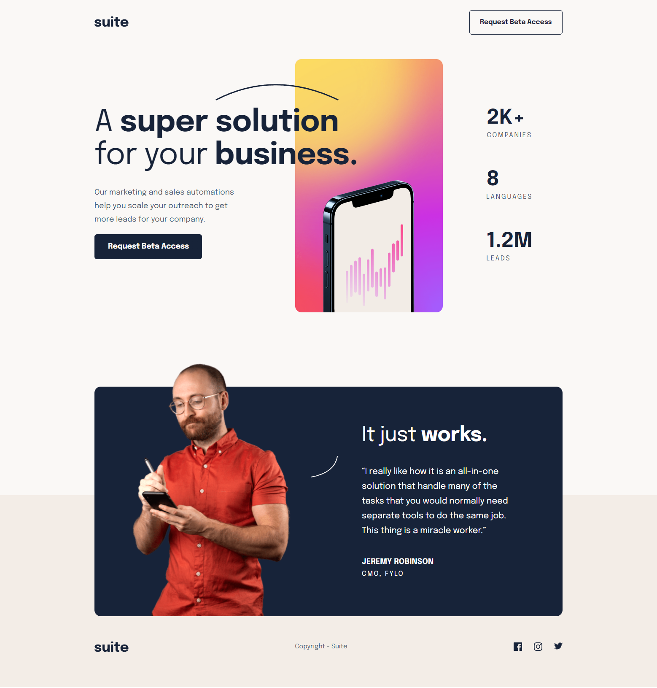

# Frontend Mentor - Suite landing page solution

This is a solution to the [Suite landing page challenge on Frontend Mentor](https://www.frontendmentor.io/challenges/suite-landing-page-tj_eaU-Ra). Frontend Mentor challenges help you improve your coding skills by building realistic projects.

## Table of contents

- [Overview](#overview)
  - [The challenge](#the-challenge)
  - [Screenshot](#screenshot)
- [My process](#my-process)
  - [Built with](#built-with)
  - [What I learned](#what-i-learned)
  - [Continued development](#continued-development)
  - [Useful resources](#useful-resources)
- [Author](#author)
- [Acknowledgments](#acknowledgments)

**Note: Delete this note and update the table of contents based on what sections you keep.**

## Overview

### The challenge

Users should be able to:

- View the optimal layout depending on their device's screen size
- See hover states for interactive elements

### Screenshot



## My process

### Built with

- Semantic HTML5 markup
- CSS custom properties
- Flexbox
- Mobile-first workflow
- JavaScript

### What I learned

#### Loaders and Scrollbars
   Wanting to add my own "touch of collor" to this project, I decided to investigate how loaders are accomplished and how scrollbars can be customized. This was surprisingly easy to accomplish thanks to W3School documentation. Kudos to it.
```css
*::-webkit-scrollbar {
    width: 10px;
}

*::-webkit-scrollbar-track {
    background: rgb(216, 202, 190);
}

*::-webkit-scrollbar-thumb {
    background-image: var(--grd-purple-yellow);
    border-radius: 10px;
    border: 0px none #ffffff;
}
```

#### Animations
   "What is a website these days without some animations ?" This question sent me down the rabbit hole but in the end it somehow turned out ok. There is definetly space for improvement and for more complexity.
```css
.animate-left {
        position: relative;
        -webkit-animation-name: animateleft;
        -webkit-animation-duration: 1.5s;
        animation-name: animateleft;
        animation-duration: 1.5s
    }

    @-webkit-keyframes animateleft {
        from {
            left: -100px;
            opacity: 0
        }

        to {
            left: 0px;
            opacity: 1
        }
    }

    @keyframes animateleft {
        from {
            left: -100px;
            opacity: 0
        }

        to {
            left: 0;
            opacity: 1
        }
    }
``` 

#### A bit of JS
   Even though there's not much and the bits that exist are poorly written, the time spent fiddling with it has definetly created a new attraction to this language and the creative options that it presents.
```js
function showPage() {
    document.getElementById("loader").style.display = "none";
    document.getElementById("element-1").style.display = "block";
    document.getElementById("element-2").style.display = "block";
    document.getElementById("element-3").style.display = "block";
}
```

### Continued development

This project has determined me to do two things :
 - Install Tailwind and fiddle with it ( I love making my own utility classes but figma files wont always be available and without those, creating classes will be much harder )
 - Explore the world of web animations ( First on the list will be Appear-based-on-scroll. Maybe in the far future I'll be able to replicate the Ipods website, who knows ? ) 

### Useful resources

- [W3Schools Loader Guide](https://www.w3schools.com/howto/howto_css_loader.asp) - This helped me create a loader.

## Author

- Frontend Mentor - [@GitDoppler](https://www.frontendmentor.io/profile/GitDoppler)

## Acknowledgments

I tip my hat to Ahmed Bayoumi for inspiration.
